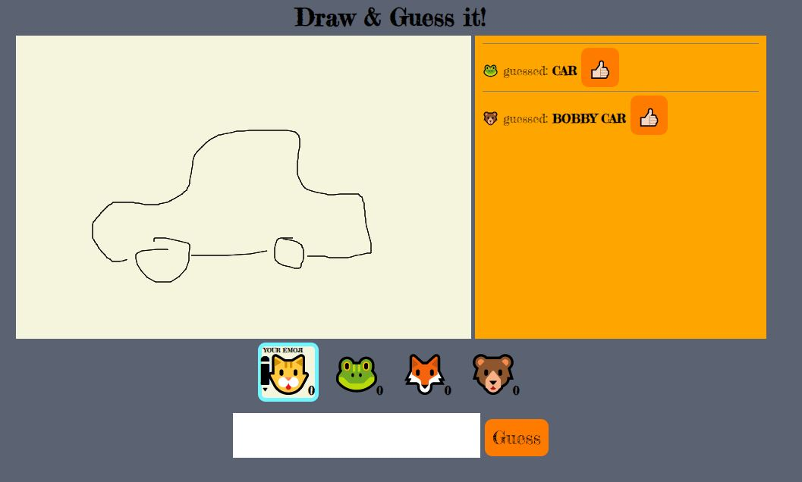

# Socket.io (Encounter)

# Draw & Guess

Someone draws, the others guess!\
How simple is that!\
Active player: Has the pencil in his emoji and a light blue border. Active player has to look for the correct answers in the chat. If the correct answer is under the guesses, than the active player should click the "thumbs-up"-button. The player, who guessed right, gets a point and the next player's turn! And so on! You can leave the "room", come and go! Only 10 players allowed. Player, who cannot enter the "room" will be redirected in to the "waiting room", and when someone leaves the "room" will be reconnected to the "room". Who guesses four times correctly is the winner!

## Tech Stack:

-   Express
-   Socket.io

[Play here](https://spicy-draw-it.glitch.me)

[Socket.io Cheatsheet](https://github.com/LPF33/guess-flag/blob/lesson/README.md)

## Preview

